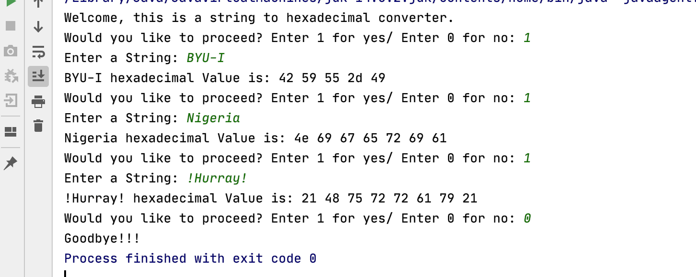

# OVERVIEW
This program converts a string to its hexadecimal value. 
It gets an input of a string from the user and outputs the equivalent hexadecimal value.
It uses Java 14.0.2 with IntelliJ IDEA and github.

# DEVELOPMENT ENVIRONMENT
* IntelliJ IDEA
* Java version 14.0.2

# EXECUTION
To execute the program: use 'javac' followed by the filename.java and 'java' followed by the filename.java

# USEFUL WEBSITES
* [Java SE Documentation](https://docs.oracle.com/javase/7/docs/)
